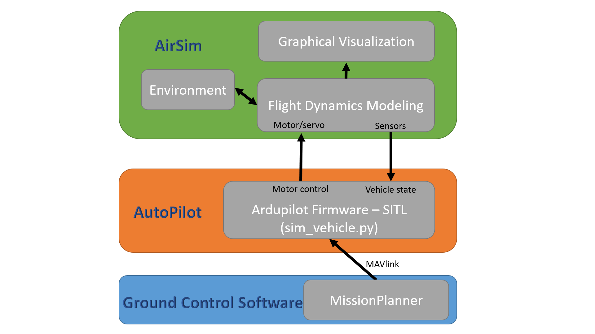
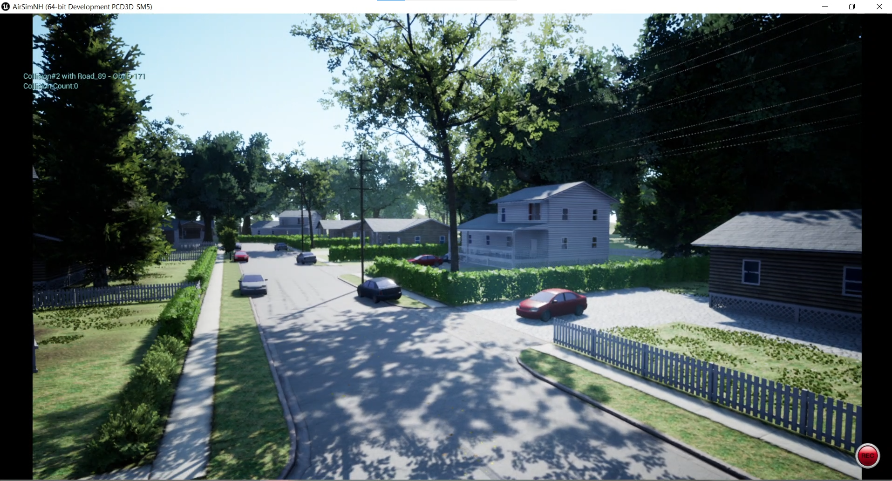

<h1 align="center"> WEEK 5&6 REPORT </h1> 

## ***Intern: Tran Minh Quang***

> ### **SIMULATION ARDUPILOT + AIRSIM**

### **I. Overview**

- Simulation allows for the safe testing of experimental code and settings. Crashing virtual vehicles is a lot cheaper than crashing real ones!

- Simulation is implemented by using a Flight Dynamics Model (FDM) of the vehicle to simulate the physics involved with vehicle movement. It receives inputs from a SITL (Software in the Loop) program running the ArduPilot firmware (which are the firmware’s servo/motor outputs) and outputs vehicle status,position, velocities, etc. that result from those inputs back to the firmware simulation. Just as sensors would in the real world case.

- ArduPilot provides a native firmware simulator + FDM program (all launched by sim_vehicle.py), often simply referred to as SITL

    

*Simulation Ardupilot + Airsim Overview*

- In addition, the ArduPilot firmware simulator element can also be interfaced to other FDM/Graphics programs that are normally used as stand-alone flight/vehicle simulators in order to get more realistic physics models and/or high definition vehicle graphics, such as X-Plane or AirSim.

### **II. AirSim Simulator**

> #### ***1. Airsim***

- In 2017 Microsoft Research created AirSim as a simulation platform for AI research and experimentation.

- AirSim is a simulator for drones, cars and more, built on [Unreal Engine](https://www.unrealengine.com/en-US) (they also have experimental support for Unity, but right now it hasn’t been implemented with ArduPilot)

- It is open-source, cross-platform and provides excellent physically and visually realistic simulations.

    

*Airsim*

- It has been developed to become a platform for AI research to experiment with deep learning, computer vision and reinforcement learning algorithms for autonomous vehicles.

- Airsim support with Ubuntu 16.04, 18.04 as well as AirSim running in Windows 10 & ArduPilot inside WSL (Ubuntu 18.04)

> #### ***2. Airsim Binaries***

- Binaries are available for AirSim for Windows and Linux platforms.

- Binaries are a quick and easy way to test out the features without installing Unreal Engine.

- Just download the precompiled environments and run to get started immediately

- Many different types of environments are available, some notable ones include LandscapeMountains, City and Neighbourhood.

    

*Airsim Binaries*

> #### ***3. Gathering training data***

- There are two ways you can generate training data from AirSim for deep learning. The easiest way is to simply press the record button in the lower right corner. This will start writing pose and images for each frame. The data logging code is pretty simple and you can modify it to your heart's content.

    

*Airsim Recording*

- A better way to generate training data exactly the way you want is by accessing the APIs. This allows you to be in full control of how, what, where and when you want to log data.

> #### ***4. Computer Vision Mode***

- In this mode, physics engine is disabled and there is no vehicle, just cameras.

- You can use the keyboard to move around the scene, or use APIs to position available cameras in any arbitrary pose, and collect images such as depth, disparity, surface normals or object segmentation.

    

*Computer Vision Mode*

> #### ***5. Weather Effects***

- Press F10 to see various options available for weather effects. You can also control the weather using APIs. Press F1 to see other options available.

    
    
    
*Weather Effects*

