<h1 align="center"> WEEK 7 REPORT </h1> 

## ***Intern: Tran Minh Quang***

> ## **Image Processing**

> ## **I. Overview**
> ### **1.1. Introduction to Machine vision**

- Machine vision encompasses all industrial and non-industrial applications in which a combination of hardware and software provide operational guidance to devices in the execution of their functions based on the capture and processing of images.

    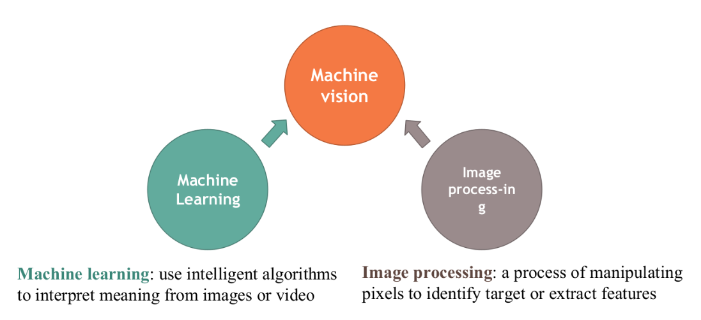

*Introduction to Machine vision*

> ### **1.2. Introduction to Image Processing**

- Image processing is analyzing and manipulating an image using math
and computer science knowledge.

    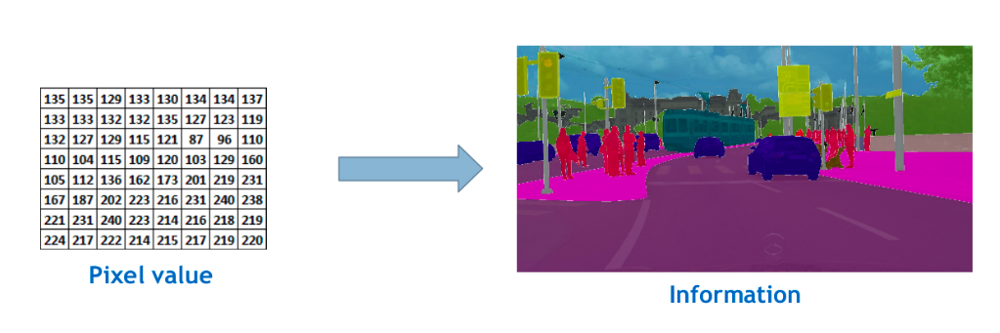

*Image Processing*

- Some applications of Images Processing:

    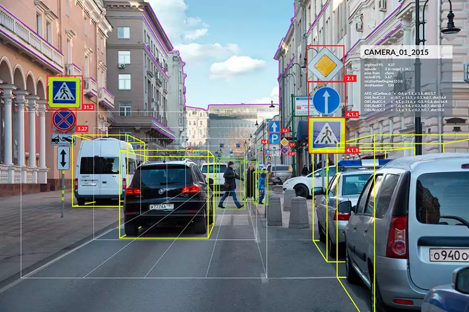

*Computer vision for self-driving car*

    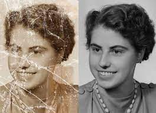

*Image Reconstruction*

    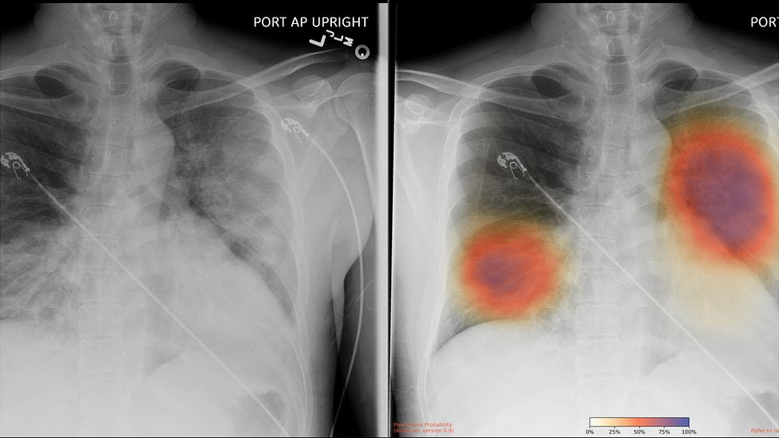

*Analyze chest X-Rays for signs of Covid-19*

> ### **1.3.Image Representation**

- Image as a matrix

    - Digital image is presented by pixel matrix

    - Image processing operation in a computer may be observed as a
    matrix operation

    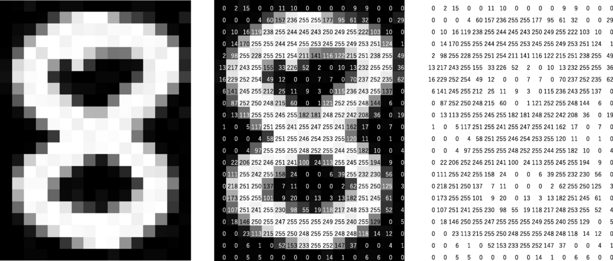

*Image of a character with its pixel intensity values*

- Color Images
    - Represented by 3 matrices
    
    - Colors are seen as variable combination of primary colors Red (R), Green (G), and blue (B)

    - Each element are integer number range from 0 to 255

    - Intensity of the pixel with respect to the color

    - In RGB system, it’s possible to create 2563=16777216 different
    colors

    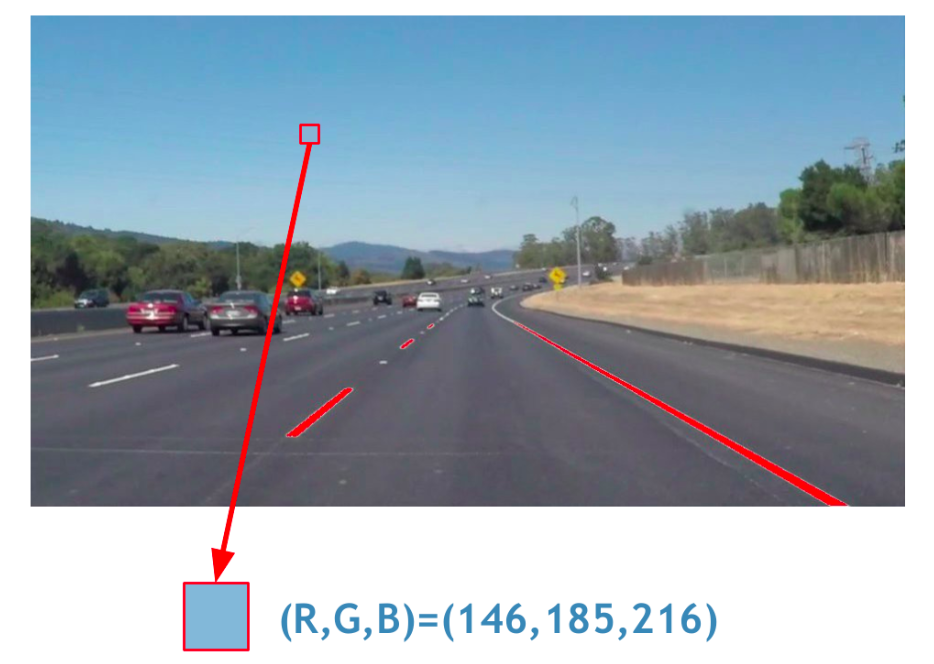
    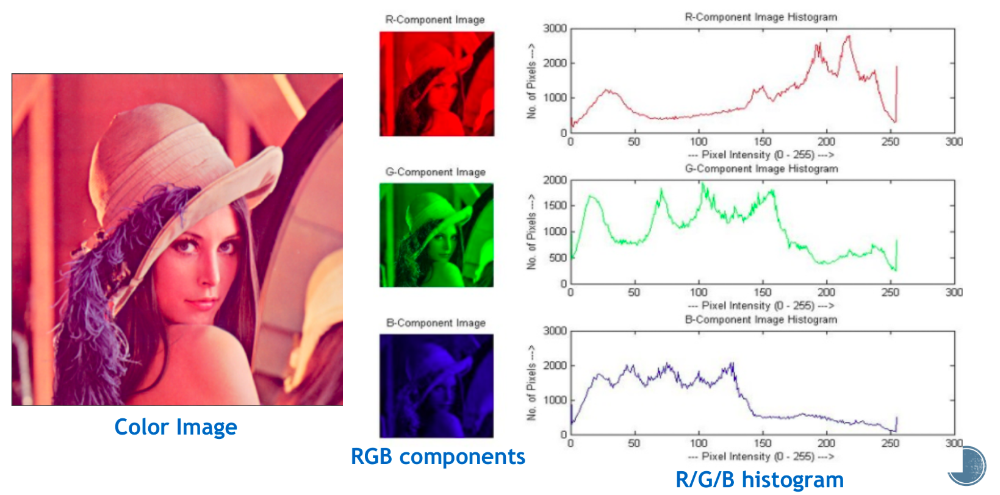

*Color Images*

- Gray Images

    - Represented by 1 matrix

    - Each element of the matrix is the intensity of the corresponding pixel 

    - Range from 0 (black) to 255 (white)

    - Range from RGB image: Gray = 0.299R + 0.587G + 0.114B

    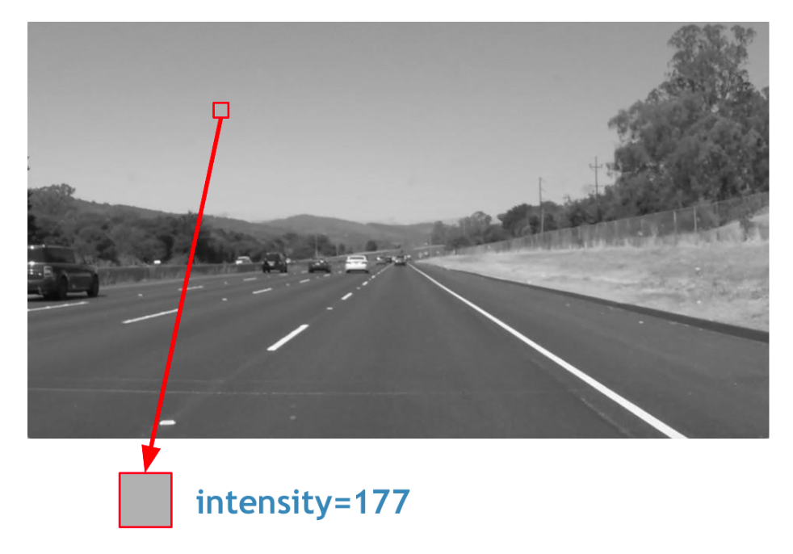
    
*Gray Images*

- Binary Images

    - Also called Boolean images

    - Represented by a matrix

    - All elements are 0 and 1: 0 is black, 1 is white

    - Result of thresholding operations

    - Important in segmentation

    
    
*Binary Images*

- Common Features in Image processing

    - Basic features: Histogram, Color, Edge, Corner,..

    - Advanced features: Regions (Centroid, size, shape,...), Lines (equations, start/end points, orientation,...), Keypoints (Location, Direction, scale,...)

> ### **1.4. Introduction to OpenCV**

- OpenCV: Open Source Computer Vision & Machine Learning software library

    - Created in 1999 by Intel

    - Supported from 2008 by Willow Garage

    - Willow Garage also supported the Robotic Operating system (ROS) and Point Cloud Library (PCL)

- OpenCV is a cross-plaform, Available in Windows, Linux, Android, MacOS,...

- OpenCV support a wide range of programming languages: Python, Java, Matlab, NVIDIA Cuda, OpenCL,...

> ## **II. Case Study** 
> ### **2.1. Object Counting**

    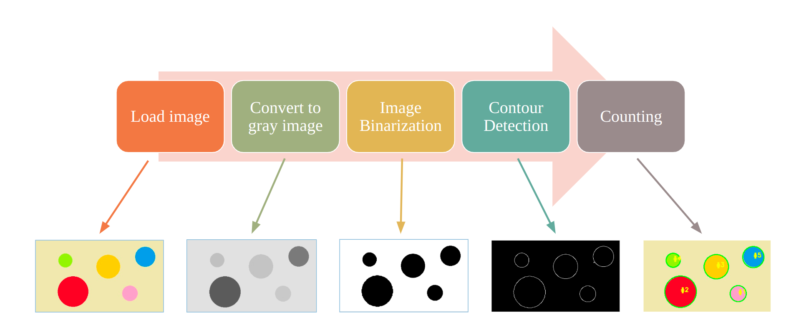
    
*Simple Object Counting Procedure*

- ***Grayscaling of Images***: is the process of converting an image from other color spaces e.g. RGB, CMYK, HSV, etc. to shades of gray. It varies between complete black and complete white. Importance of grayscaling: Dimension reduction, Reduces model complexity, For other algorithms to work,... 

- ***Image binarization*** is the process of taking a grayscale image and converting it to black-and-white, essentially reducing the information contained within the image from 256 shades of gray to 2: black and white, a binary image. 

- ***Contour***: When we join all the points on the boundary of an object, we get a contour. Typically, a specific contour refers to boundary pixels that have the same color and intensity.OpenCV makes it really easy to find and draw contours in images. It provides two simple functions: findContours(), drawContours()

> ### **2.1.1. Image smoothing**

- ***Image smoothing***:  is a key technique in image processing used to reduces noise within an image

    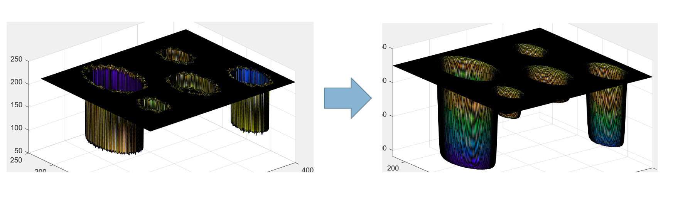
    
*Image Smoothing*

- 