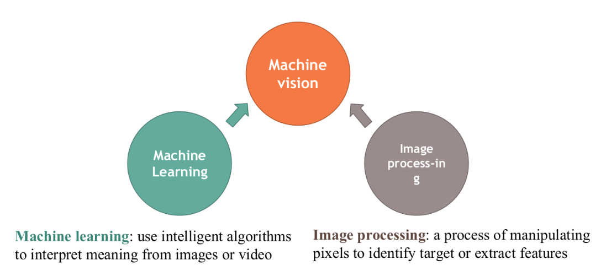
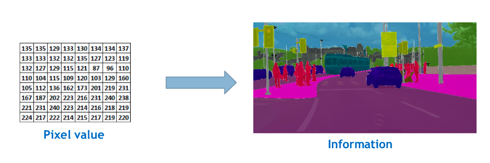
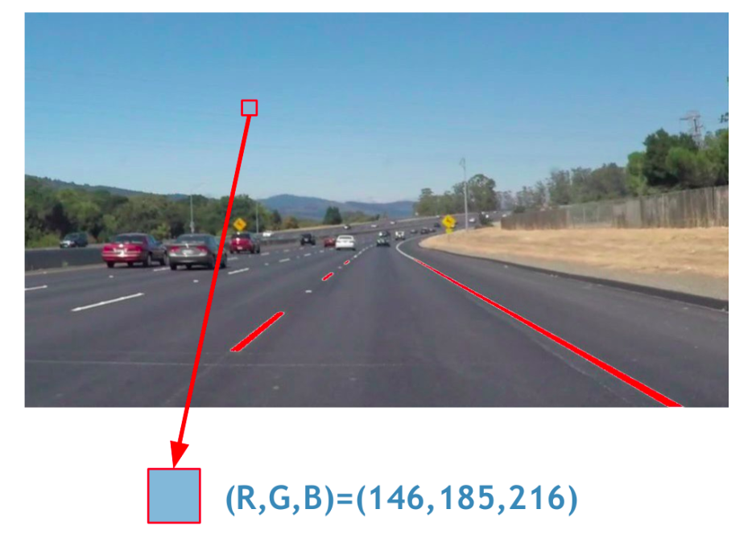
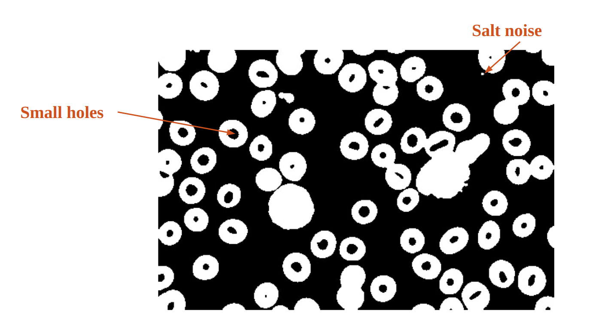
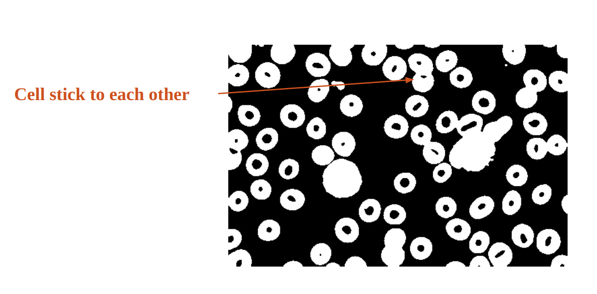

<h1 align="center"> WEEK 7 REPORT </h1>

## ***Intern: Tran Minh Quang***

> ## **Image Processing**

> ## **I. Overview**

> ### **1.1. Introduction to Machine vision**

- Machine vision encompasses all industrial and non-industrial applications in which a combination of hardware and software provide operational guidance to devices in the execution of their functions based on the capture and processing of images.

    

*Introduction to Machine vision*

> ### **1.2. Introduction to Image Processing**

- Image processing is analyzing and manipulating an image using math
and computer science knowledge.

    

*Image Processing*

- Some applications of Images Processing:

    

*Computer vision for self-driving car*

    

*Image Reconstruction*

    

*Analyze chest X-Rays for signs of Covid-19*

> ### **1.3.Image Representation**

- Image as a matrix

  - Digital image is presented by pixel matrix

  - Image processing operation in a computer may be observed as a
    matrix operation

    

*Image of a character with its pixel intensity values*

- Color Images
  - Represented by 3 matrices

  - Colors are seen as variable combination of primary colors Red (R), Green (G), and blue (B)

  - Each element are integer number range from 0 to 255

  - Intensity of the pixel with respect to the color

  - In RGB system, it’s possible to create 2563=16777216 different
    colors

    
    

*Color Images*

- Gray Images

  - Represented by 1 matrix

  - Each element of the matrix is the intensity of the corresponding pixel

  - Range from 0 (black) to 255 (white)

  - Range from RGB image: Gray = 0.299R + 0.587G + 0.114B

    

*Gray Images*

- Binary Images

  - Also called Boolean images

  - Represented by a matrix

  - All elements are 0 and 1: 0 is black, 1 is white

  - Result of thresholding operations

  - Important in segmentation

    

*Binary Images*

- Common Features in Image processing

  - Basic features: Histogram, Color, Edge, Corner,..

  - Advanced features: Regions (Centroid, size, shape,...), Lines (equations, start/end points, orientation,...), Keypoints (Location, Direction, scale,...)

> ### **1.4. Introduction to OpenCV**

- OpenCV: Open Source Computer Vision & Machine Learning software library

  - Created in 1999 by Intel

  - Supported from 2008 by Willow Garage

  - Willow Garage also supported the Robotic Operating system (ROS) and Point Cloud Library (PCL)

- OpenCV is a cross-plaform, Available in Windows, Linux, Android, MacOS,...

- OpenCV support a wide range of programming languages: Python, Java, Matlab, NVIDIA Cuda, OpenCL,...

> ## **II. Case Study**

> ### **2.1. Object Counting**

    

*Simple Object Counting Procedure*

- ***Grayscaling of Images***: is the process of converting an image from other color spaces e.g. RGB, CMYK, HSV, etc. to shades of gray. It varies between complete black and complete white. Importance of grayscaling: Dimension reduction, Reduces model complexity, For other algorithms to work,...

- ***Image binarization*** is the process of taking a grayscale image and converting it to black-and-white, essentially reducing the information contained within the image from 256 shades of gray to 2: black and white, a binary image.

- ***Contour***: When we join all the points on the boundary of an object, we get a contour. Typically, a specific contour refers to boundary pixels that have the same color and intensity.OpenCV makes it really easy to find and draw contours in images. It provides two simple functions: findContours(), drawContours()

> ### **2.1.1. Problem 1: Image Noise**

    

*Image Noise*

- ***Image Blurring (Image Smoothing)***:  Image blurring is achieved by convolving the image with a low-pass filter kernel. It is useful for removing noise. It actually removes high frequency content (eg: noise, edges) from the image. So edges are blurred a little bit in this operation (there are also blurring techniques which don't blur the edges).
  - ***Averaging (mean filter)***: This is done by convolving an image with a normalized box filter. It simply takes the average of all the pixels under the kernel area and replaces the central element. We should specify the width and height of the kernel.

    

    

    *Image Blurring*
    

  - ***Gaussian Blurring*** In this method, instead of a box filter, a Gaussian kernel is used. We should specify the width and height of the kernel which should be positive and odd. We also should specify the standard deviation in the X and Y directions, sigmaX and sigmaY respectively. If only sigmaX is specified, sigmaY is taken as the same as sigmaX. If both are given as zeros, they are calculated from the kernel size. Gaussian blurring is highly effective in removing Gaussian noise from an image.

    

    

    *Image Gaussian Blurring*
    

  - ***Median Blurring*** takes the median of all the pixels under the kernel area and the central element is replaced with this median value. This is highly effective against salt-and-pepper noise in an image. Interestingly, in the above filters, the central element is a newly calculated value which may be a pixel value in the image or a new value. But in median blurring, the central element is always replaced by some pixel value in the image. It reduces the noise effectively. Its kernel size should be a positive odd integer.

    

    

    *Image Median Blurring*
    

> ### **2.1.2. Problem 2: Small holes  / Salt noise**

*Small holes  / Salt noise*

- ***Morphology***: A set of operations that expand or shrink object’s shape. 2 basic Morphological operations:
  - Dilation: Expand the original shapes
  - Erosion: Shrink the original shape

*Dilation and Erosion*

- ***Opening*** is defined as an erosion followed by a dilation using the same structuring element for both operations

- ***Closing*** is defined as a dilation followed by an erosion using the same structuring element for both operations.

*Opening and Closing*

> ### **2.1.3. Problem 3: Object cluster/occlusion**

*Object cluster/occlusion*

- ***Distance transform*** convert matrix of pixel intensity values into distance map
  - Each pixel now show the shortest distance from itself to the nearest black area
  - Only apply for binary image

*Distance transform*

> ### **2.2. Object Detection**

> ### **2.2.1. Detect edges, contours with Canny**

- ***Canny*** is an edge detection operator that uses a multi-stage algorithm to detect a wide range of edges in images. It was developed by John F. Canny in 1986. Canny also produced a computational theory of edge detection explaining why the technique works.

- Four step process to Canny edge detection:
  - *Noise Reduction* using 5x5 Gaussian smoothing. This step is fairly intuitive and straightforward. As we learned from our tutorial on smoothing and blurring, smoothing an image allows us to ignore much of the detail and instead focus on the actual structure.

  - *Finding Intensity Gradient* of the Image, an image gradient is defined as a directional change in image intensity

    

    

    *Computing the gradient magnitude* .
    

  - *Non-maximum Suppression:* a full scan of image is done to remove any unwanted pixels which may not constitute the edge. For this, at every pixel, pixel is checked if it is a local maximum in its neighborhood in the direction of gradient.
    

    

    *The edge A is above the maxVal, so considered as "sure-edge". Although edge C is below maxVal, it is connected to edge A, so that also considered as valid edge and we get that full curve. But edge B, although it is above minVal and is in same region as that of edge C, it is not connected to any "sure-edge", so that is discarded*
    

  - *Hysteresis Thresholding* This stage decides which are all edges are really edges and which are not. For this, we need two threshold values, minVal and maxVal. Any edges with intensity gradient more than maxVal are sure to be edges and those below minVal are sure to be non-edges, so discarded. Those who lie between these two thresholds are classified edges or non-edges based on their connectivity. If they are connected to "sure-edge" pixels, they are considered to be part of edges. Otherwise, they are also discarded.

    

    

    *Point A is on the edge ( in vertical direction). Gradient direction is normal to the edge. Point B and C are in gradient directions. So point A is checked with point B and C to see if it forms a local maximum. If so, it is considered for next stage, otherwise, it is suppressed ( put to zero)*
    

